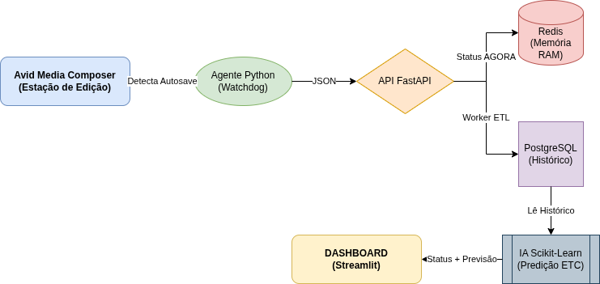

# **Media Compose Dashboard: Monitoramento e Inteligência para Ilhas de Edição**

Este projeto é um ecossistema inteligente projetado para transformar a atividade bruta das ilhas de edição em dados estratégicos e previsões em tempo real. Ele resolve o desafio de gestores que precisam saber quem está operando, em qual projeto e, principalmente, quando o trabalho será concluído, sem interromper o fluxo criativo dos editores.

## **Como o Sistema Funciona: O Fluxo de Trabalho**

O sistema opera de forma silenciosa e automática, seguindo quatro grandes etapas que conectam a estação de trabalho do editor à tela do gestor.


### **1\. Captura Invisível (A Ponta)**

Tudo começa na estação de trabalho onde o **Avid Media Composer** está rodando. Um componente chamado **Agente de Coleta** fica vigilante no plano de fundo.

* **Ação**: Sempre que o editor salva o projeto ou o Avid faz um backup automático, o Agente detecta essa movimentação no armazenamento (storage).  
* **Diferencial**: O editor não precisa apertar nenhum botão extra; o monitoramento é feito por meio dos eventos do próprio sistema operacional.

# Globo2-PE — Backend & Pipeline de Monitoramento

> Sistema de monitoramento inteligente de ilhas de edição Avid Media Composer para a Globo PE.  
> Detecta atividade em tempo real, persiste histórico e sinaliza conclusão de projetos automaticamente.

---

## Visão Geral

```
Avid salva arquivo na pasta do projeto
           ↓
   agent/monitor.py          ← Watchdog: detecta mudanças no SO
           ↓  HTTP POST /events
   backend/Flask             ← Recebe e distribui
           ↓  RPUSH
   Redis (fila)              ← Buffer de eventos em tempo real
           ↓  BLPOP
   backend/worker/worker.py  ← ETL: transforma e persiste
           ↓
   PostgreSQL                ← Histórico completo + status dos projetos
```

---

## Convenção de Pastas

O sistema interpreta o **nome da pasta** para identificar editor e projeto automaticamente.  
O editor não precisa fazer nada além de trabalhar normalmente no Avid.

```
arquivos_teste/
└── LUC ANIVERSARIO RECIFE/     ← "LUC" = código do editor, resto = nome do projeto
    ├── video.avp               ← arquivo em edição → projeto "em_andamento"
    └── final/
        └── entrega.avp         ← qualquer arquivo aqui → projeto marcado como "concluido"
```

### Mapa de códigos de editor

| Código | Editor |
|--------|--------|
| `LUC` | Lucas Cardoso Alecrim |
| `SAM` / `SAMUEL` | Samuel Santos |
| `JOA` | João Oliveira |
| `ANA` | Ana Paula Ferreira |

> Para adicionar novos editores, edite `USUARIO_MAP` em `agent/monitor.py`.

---

## Estrutura do Projeto

```
globo2-PE/
├── start.sh                    # Sobe todo o ecossistema de uma vez
├── stop.sh                     # Encerra tudo
├── docker-compose.yml          # Orquestração dos containers
├── docker.py                   # Helper para subir/derrubar o Compose
│
├── agent/
│   ├── monitor.py              # Watchdog — monitora pasta e envia eventos ao backend
│   ├── arquivos_teste/         # Pasta monitorada (simula o storage do Avid)
│   └── requirements.txt
│
├── backend/
│   ├── app.py                  # Flask — entry point da API
│   ├── database.py             # Conexões lazy com Redis e PostgreSQL
│   ├── routes/
│   │   ├── event_routes.py     # POST /events, GET /events/status, GET /events/fila
│   │   ├── dashboard_routes.py # GET /dashboard
│   │   └── health_routes.py    # GET /health
│   ├── worker/
│   │   └── worker.py           # ETL — consome fila Redis e persiste no Postgres
│   └── requirements.txt
│
└── data_ia/
    └── etl_process.py          # ETL alternativo (referência / uso futuro pela IA)
```

---

## Pré-requisitos

- Docker + Docker Compose
- Python 3.11+
- `python-pipx` ou `python-venv` (para o agente local)

---

## Como Usar

### 1. Subir tudo com um comando

```bash
chmod +x start.sh stop.sh   # apenas na primeira vez
./start.sh
```

O script faz automaticamente:
1. Sobe os containers Docker (Postgres + Redis + Backend)
2. Aguarda o backend estar respondendo em `:5000`
3. Inicia o Worker ETL dentro do container
4. Cria o virtualenv do agente (só na primeira vez)
5. Inicia o Watchdog em foreground (logs visíveis no terminal)

### 2. Encerrar tudo

```bash
./stop.sh
```

---

## Simular Atividade (Testes)

```bash
# Criar pasta de projeto e arquivo em edição
mkdir -p agent/arquivos_teste/"LUC ANIVERSARIO RECIFE"
touch agent/arquivos_teste/"LUC ANIVERSARIO RECIFE"/video.avp

# Sinalizar conclusão do projeto (jogar qualquer arquivo na pasta /final/)
mkdir -p agent/arquivos_teste/"LUC ANIVERSARIO RECIFE/final"
touch agent/arquivos_teste/"LUC ANIVERSARIO RECIFE/final"/entrega.avp
```

---

## Rotas da API

### `GET /health`
Verifica se o backend está no ar.

```json
{ "status": "ok", "message": "Backend funcionando corretamente" }
```

---

### `POST /events`
Recebe eventos do Watchdog. Corpo esperado:

```json
{
  "tipoEvento": "created",
  "arquivo":    "video.avp",
  "caminho":    "/abs/path/LUC ANIVERSARIO RECIFE/video.avp",
  "timestamp":  "2026-05-16 17:27:00",
  "pasta":      "LUC ANIVERSARIO RECIFE",
  "usuario":    "Lucas Cardoso Alecrim",
  "projeto":    "ANIVERSARIO RECIFE"
}
```

Resposta:
```json
{ "status": "ok", "message": "Evento enfileirado com sucesso", "fila": 1 }
```

---

### `GET /events/status`
Retorna o estado **em tempo real** de todos os editores (via Redis).

```json
{
  "total": 2,
  "editores": [
    {
      "status":      "ocupado",
      "editor":      "Lucas Cardoso Alecrim",
      "projeto":     "Aniversario Recife",
      "arquivo":     "video.avp",
      "ultimo_save": "2026-05-16 17:25:00",
      "is_final":    "False"
    },
    {
      "status":      "concluido",
      "editor":      "Samuel Santos",
      "projeto":     "Eu Lembro Am",
      "arquivo":     "corte.avp",
      "ultimo_save": "2026-05-16 17:27:17",
      "is_final":    "True"
    }
  ]
}
```

---

### `GET /events/fila`
Retorna quantos eventos estão pendentes na fila do Redis (sem consumir).

```json
{ "fila": "eventos_watchdog", "tamanho": 3 }
```

---

### `GET /dashboard`
Retorna dados mockados do dashboard para desenvolvimento do frontend.

---

## Tabelas do PostgreSQL

### `usuarios`
| Campo | Tipo | Descrição |
|-------|------|-----------|
| `id` | SERIAL | PK |
| `nome` | TEXT | Nome completo do editor |
| `criado_em` | TIMESTAMPTZ | Data de criação |

### `projetos`
| Campo | Tipo | Descrição |
|-------|------|-----------|
| `id` | SERIAL | PK |
| `nome` | TEXT | Nome do projeto |
| `usuario_id` | INT | FK → usuarios |
| `status` | TEXT | `em_andamento` ou `concluido` |
| `concluido_em` | TIMESTAMPTZ | Preenchido quando cai na pasta `/final/` |
| `criado_em` | TIMESTAMPTZ | Data de criação |

### `eventos`
| Campo | Tipo | Descrição |
|-------|------|-----------|
| `id` | SERIAL | PK |
| `tipo` | TEXT | `created`, `modified`, `deleted`, `closed` |
| `arquivo` | TEXT | Nome do arquivo |
| `caminho` | TEXT | Caminho absoluto |
| `pasta` | TEXT | Nome da pasta do projeto |
| `is_final` | BOOLEAN | `true` se veio da subpasta `/final/` |
| `usuario_id` | INT | FK → usuarios |
| `projeto_id` | INT | FK → projetos |
| `ocorrido_em` | TIMESTAMPTZ | Timestamp do evento |

### `edicoes`
Usada pela camada de IA para calcular o ETC (Estimated Time of Completion).

| Campo | Tipo | Descrição |
|-------|------|-----------|
| `id` | SERIAL | PK |
| `editor` | TEXT | Nome do editor |
| `arquivo` | TEXT | Arquivo sendo editado |
| `projeto` | TEXT | Nome do projeto |
| `inicio_edicao` | TIMESTAMPTZ | Primeiro evento detectado |
| `fim_edicao` | TIMESTAMPTZ | Último evento (ou quando foi para `/final/`) |
| `duracao_segundos` | INT | Calculado automaticamente |
| `tamanho_arquivo_mb` | FLOAT | Para uso pelo modelo de IA |

---

## Consultas Úteis

```bash
# Ver status atual de todos os projetos
docker exec globo2-postgres psql -U globo_user -d globo2_db -c "
SELECT p.nome AS projeto, u.nome AS usuario, p.status, p.concluido_em
FROM projetos p JOIN usuarios u ON u.id = p.usuario_id;"

# Ver últimos eventos registrados
docker exec globo2-postgres psql -U globo_user -d globo2_db -c "
SELECT u.nome AS usuario, p.nome AS projeto, e.tipo, e.arquivo, e.is_final, e.ocorrido_em
FROM eventos e
JOIN usuarios u ON u.id = e.usuario_id
JOIN projetos p ON p.id = e.projeto_id
ORDER BY e.ocorrido_em DESC LIMIT 20;"

# Ver fila Redis (eventos pendentes)
docker exec globo2-redis redis-cli LLEN eventos_watchdog

# Ver estado em tempo real dos editores
docker exec globo2-redis redis-cli KEYS "editor:*"
docker exec globo2-redis redis-cli HGETALL "editor:lucas_cardoso_alecrim"

# Logs do worker ETL
docker exec globo2-backend cat /tmp/worker.log

# Logs do backend Flask
docker logs globo2-backend
```

---

## Variáveis de Ambiente

Configuradas no `docker-compose.yml`:

| Variável | Padrão | Descrição |
|----------|--------|-----------|
| `DB_HOST` | `postgres` | Host do PostgreSQL |
| `DB_PORT` | `5432` | Porta do PostgreSQL |
| `DB_NAME` | `globo2_db` | Nome do banco |
| `DB_USER` | `globo_user` | Usuário |
| `DB_PASSWORD` | `123456` | Senha |
| `REDIS_HOST` | `redis` | Host do Redis |
| `REDIS_PORT` | `6379` | Porta do Redis |

---

### **2\. Processamento Instantâneo (O Agora)**

Assim que o Agente percebe uma mudança, ele envia um sinal para o **Coração do Sistema (API)**.

* **Atualização em Milissegundos**: A informação de que o "Editor X" está trabalhando no "Projeto Y" é gravada em uma memória de alta velocidade (Redis).  
* **Visualização Reativa**: O Dashboard para os gestores é atualizado instantaneamente via WebSockets. Se um editor parar de salvar por um longo período, o sistema consegue sinalizar que aquela ilha pode estar ociosa ou livre.

### **3\. Memória Institucional (O Passado)**

Enquanto o Dashboard mostra o que está acontecendo "agora", o sistema organiza esses dados para o futuro.

* **Histórico Detalhado**: Cada sessão de edição é registrada em um banco de dados robusto (PostgreSQL).  
* **Dados Armazenados**: Início da edição, fim da edição, tempo total de uso e o tamanho dos arquivos manipulados. Isso elimina a necessidade de preenchimento manual de planilhas de produtividade.

### **4\. Predição com Inteligência Artificial (O Futuro)**

O grande diferencial deste projeto é a sua capacidade de prever prazos utilizando **Scikit-Learn**.

* **Aprendizado**: A Inteligência Artificial analisa os meses de histórico armazenados no banco de dados. Ela aprende, por exemplo, que o "Editor João" costuma levar 4 horas para finalizar um projeto de 2GB no Avid.  
* **Estimativa de Entrega (ETC)**: Quando uma nova edição começa, o sistema cruza o tamanho do arquivo com o comportamento histórico do editor e exibe no Dashboard: *"Previsão de término: 15h30"*.

---

## **Os Componentes e Suas Funções**

Para que tudo isso aconteça, o projeto utiliza uma arquitetura moderna baseada em containers (**Docker**), onde cada parte tem uma responsabilidade única:

| Componente | Papel no Ecossistema |
| :---- | :---- |
| **Agente (Watchdog)** | O vigia que detecta quando o Avid Media Composer salva arquivos. |
| **Cérebro (Flask)** | Recebe os alertas do Agente e distribui para o resto do sistema. |
| **Memória Flash (Redis)** | Garante que o status "Ocupado/Livre" apareça na tela em tempo real. |
| **Arquivo (PostgreSQL)** | Guarda todo o histórico para relatórios de produtividade e auditoria. |
| **IA (Scikit-Learn)** | Calcula o tempo que falta para o editor terminar o trabalho. |
| **Dashboard (Front-end)** | A interface visual onde o gestor acompanha tudo de forma clara. |

## **1\. Visão Geral da Arquitetura**

O sistema baseia-se em uma arquitetura orientada a eventos, onde a detecção de alterações em arquivos de projeto dispara uma cadeia de processamento que resulta em visualizações em tempo real e predições baseadas em IA.

| Camada | Tecnologia | Justificativa Técnica |
| :---- | :---- | :---- |
| **Coleta (Agente)** | Python (Watchdog) | Monitoramento leve de eventos do SO (criação/edição) sem sobrecarga de storage. |
| **Backend (API)** | Flask | Alta performance assíncrona, ideal para WebSockets e documentação automática. |
| **Mensageria/Cache** | Redis | Intermediário ultrarrápido para estados transitórios (Livre/Ocupado) em memória. |
| **Banco de Dados** | PostgreSQL | Persistência de dados históricos para auditoria e treinamento de modelos. |
| **Inteligência (IA)** | Scikit-Learn / Pandas | Predição de tempo de conclusão (ETC) com base em regressão histórica. |
| **Processamento (ETL)** | Python Worker | Container dedicado para limpeza de dados e transformação de eventos em métricas. |
| **Dashboard** | Streamlit / Next.js | Interface reativa para acompanhamento gerencial. |

## **2\. Estrutura de Diretórios**

```plaintext
GLOBO2-PE
│
├── docker-compose.yml
├── .env
│
├── agent/                # Watchdog (captura eventos)
│   ├── monitor.py
│   └── requirements.txt
│
├── backend/              # API Flask (cérebro)
│   ├── main.py
│   ├── database.py
│   └── requirements.txt
│
├── data_ia/              # ETL + IA
│   ├── etl_process.py
│   ├── predictor.py
│   └── requirements.txt
│
├── frontend/             # Dashboard
│   ├── app.py
│   └── requirements.txt
│
├── redis_config/
│   └── redis.conf
│
└── postgres/
    └── init.sql

```
---

## **3\. Fluxo de Dados (Data Journey)**

O "Caminho do Dado" segue cinco etapas fundamentais para garantir a baixa latência no Dashboard e a integridade no banco de dados:

1. **Detecção:** O **Agente** identifica que um editor salvou um arquivo (ex: `.prproj`) no storage.  
2. **Notificação:** A **API** recebe o evento e atualiza o **Redis** instantaneamente.  
3. **Persistência:** O **Worker de ETL** captura o evento e o salva no **PostgreSQL**.  
4. **Predição:** A **IA** analisa o volume do arquivo e o histórico do editor para calcular o tempo restante.  
5. **Visualização:** O **Dashboard** exibe: *"Editor X: Ocupado | Previsão de entrega: 15min"*.

---

## **4\. Componentes de Armazenamento e Inteligência**

### **4.1 Redis: O Estado em Tempo Real**

O Redis é utilizado para gerenciar estados voláteis. Ao utilizar a estrutura de `HSET` ou `Pub/Sub`, o dashboard recebe atualizações sem a necessidade de requisições constantes (polling).

* **Exemplo de Comando:** `SET editor:joao "ocupado"`  
* **Vantagem:** Resposta em \~1ms, comparado aos 10-100ms de bancos convencionais.

### **4.2 PostgreSQL: O Cérebro Histórico**

Diferente do Redis, o Postgres armazena a estrutura para análise de longo prazo.

```sql
CREATE TABLE edicoes (
    id SERIAL PRIMARY KEY,
    editor VARCHAR(100),
    arquivo VARCHAR(255),
    inicio_edicao TIMESTAMP,
    fim_edicao TIMESTAMP,
    duracao_segundos INT
);
```

### **4.3 Scikit-Learn: Predição de Produtividade**

O modelo de Machine Learning utiliza os dados do PostgreSQL para prever o tempo de entrega.

```python
import pandas as pd
from sklearn.linear_model import LinearRegression

# Exemplo de lógica do predictor.py
def predict_editing_time(tamanho_arquivo_novo):
    # Dados extraídos do PostgreSQL
    data = pd.DataFrame({
       "tamanho_arquivo": [500, 700, 300],
       "duracao": [1500, 1800, 1200]
    })

    X = data[["tamanho_arquivo"]]
    y = data["duracao"]

    model = LinearRegression()
    model.fit(X, y)

    return model.predict([[tamanho_arquivo_novo]])
```

---

## **5\. Resumo de Responsabilidades**

| Componente | Função Principal |
| :---- | :---- |
| **Redis** | Estado momentâneo (Agora) |
| **PostgreSQL** | Histórico e Auditoria (Passado) |
| **Scikit-Learn** | Inteligência e Previsão (Futuro) |
| **Flask** | Orquestração e Lógica |
| **Watchdog** | Gatilho de eventos |

---

A parte de Inteligência Artificial (IA) é o diferencial estratégico deste projeto, pois ela transforma o monitoramento passivo em uma ferramenta de **análise preditiva**. Em vez de apenas dizer o que está acontecendo agora, a IA projeta o futuro.

Aqui está o detalhamento de como essa camada funciona, do aprendizado à previsão:

### **1\. A Fonte do Conhecimento (Dados Históricos)**

A IA não "adivinha"; ela calcula com base em evidências.

* **Coleta de Dados**: O sistema utiliza o **PostgreSQL** para armazenar o histórico de todas as edições finalizadas no **Avid Media Composer**.  
* **Variáveis Analisadas (Features)**: Para o modelo aprender, ele observa principalmente duas informações: o **tamanho do arquivo de projeto** (volume de dados) e o **tempo real que o editor levou** para concluir aquela tarefa.

### **2\. O Modelo de Aprendizado (Scikit-Learn)**

O projeto utiliza a biblioteca **Scikit-Learn**, focada em um algoritmo chamado **Regressão Linear**.

* **Treinamento**: O modelo analisa o passado (ex: "Sempre que o Editor João pegou um arquivo de 500MB, ele levou cerca de 25 minutos").  
* **Padrões Individuais**: A IA consegue identificar que editores diferentes possuem ritmos diferentes, criando uma base de comparação justa e precisa para cada profissional.

### **3\. O Cálculo da Previsão (Inferência)**

Quando uma nova edição começa, o fluxo de inteligência entra em ação:

* **Entrada de Dados**: O **Agente** detecta que o editor abriu um novo projeto no Avid e identifica o tamanho inicial desse arquivo.  
* **Processamento**: A API consulta o modelo de IA pré-treinado, passando os dados atuais da ilha de edição.  
* **Saída (ETC)**: A IA gera o **ETC (Estimated Time of Completion)**, ou seja, a estimativa de término.

### **4\. Ciclo de Melhoria Contínua**

Diferente de uma regra fixa, a IA deste projeto é dinâmica:

* **Retroalimentação**: Toda vez que uma edição termina, os dados reais (tempo que levou de fato) são salvos no banco de dados.  
* **Re-treinamento**: O modelo pode ser atualizado periodicamente com esses novos dados, tornando as previsões cada vez mais precisas conforme o sistema é utilizado.

### **Resumo do Papel da IA no Dashboard**

No painel visual do gestor, a IA converte dados frios em informações acionáveis:

* **Sem IA**: "Editor João: Ocupado há 10 minutos."  
* **Com IA**: "Editor João: Ocupado. **Previsão de entrega: 15 minutos restantes**."

---
